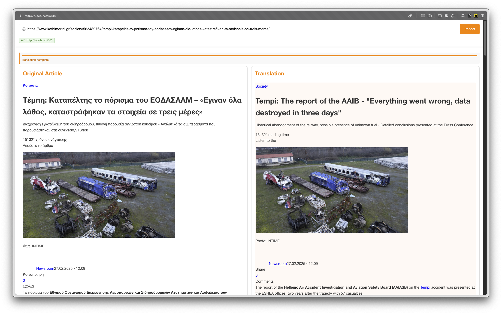

# Language Split

Language Split is a web application that allows you to import articles from the web and translate them to English. It presents the original text side-by-side with its translation, making it easy to compare and learn.



## Features

- Import articles from any web URL
- Automatic language detection and translation to English
- Side-by-side comparison of original and translated content
- Real-time translation updates as content is processed
- Synchronized scrolling between original and translated text

## Getting Started

### Prerequisites

- Node.js (v14 or higher)
- npm (v6 or higher)
- An OpenAI API key

### Installation

1. Clone this repository:
   ```
   git clone https://github.com/yourusername/language_split.git
   cd language_split
   ```

2. Install dependencies for both client and server:
   ```
   npm install
   cd server
   npm install
   cd ..
   ```

3. Create a `.env` file in the root directory with your OpenAI API key:
   ```
   OPENAI_API_KEY=your_openai_api_key_here
   ```

### Running the Application

1. Start the application (both server and client):
   ```
   npm run dev
   ```

2. Alternatively, you can run the server and client separately:
   ```
   # In one terminal:
   npm run server
   
   # In another terminal:
   npm start
   ```

3. Access the application at [http://localhost:3000](http://localhost:3000)

### Usage

1. Enter the URL of an article you want to translate in the URL bar at the top of the page.
2. Click "Import" to fetch and translate the content.
3. The original content will appear in the left panel immediately.
4. The translation will appear in the right panel as it's being processed.
5. You can scroll either panel, and the other will synchronize to match.
6. The progress bar at the top shows the translation progress.

## How It Works

Language Split uses a combination of technologies:

- React for the frontend user interface
- Express.js for the backend API server
- OpenAI API for translation services
- Axios and Cheerio for web scraping
- DOMPurify for sanitizing HTML content

The application:
1. Scrapes the content from the provided URL
2. Splits the content into manageable chunks
3. Translates each chunk using OpenAI's language models
4. Displays the translated content in real-time as chunks are processed
5. Combines the chunks into a complete translation

## Troubleshooting

### Port Conflicts
If you encounter port conflicts, the server will automatically try to use different ports (5000-5005). You can also manually kill processes on specific ports:

```
npm run kill-ports
```

### Connection Issues
If the API server doesn't connect, check:
1. That the server is running
2. That there are no firewall issues blocking connections
3. That the ports 5000-5005 are available

### Translation Issues
If translations appear incomplete or incorrect:
1. Check that your OpenAI API key is valid
2. Ensure the content being translated is not too large
3. Try importing a smaller article or a different source
